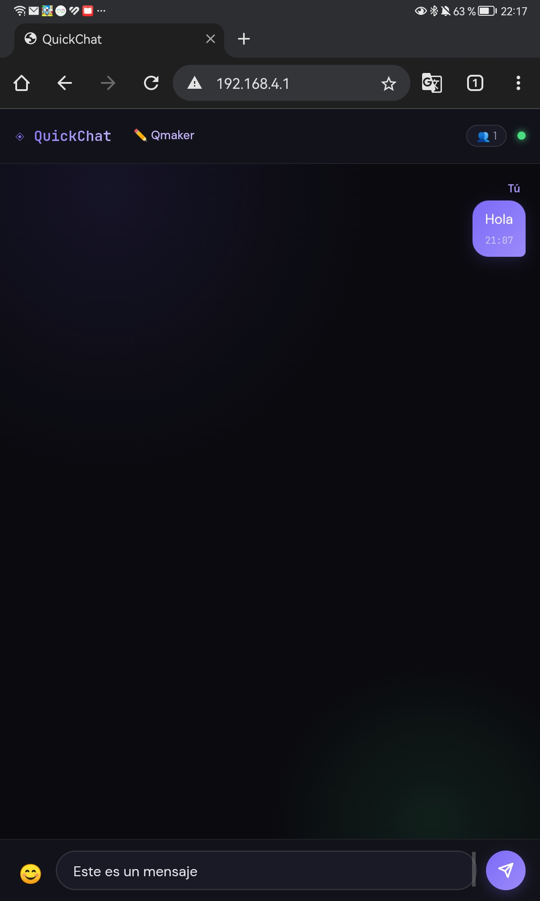
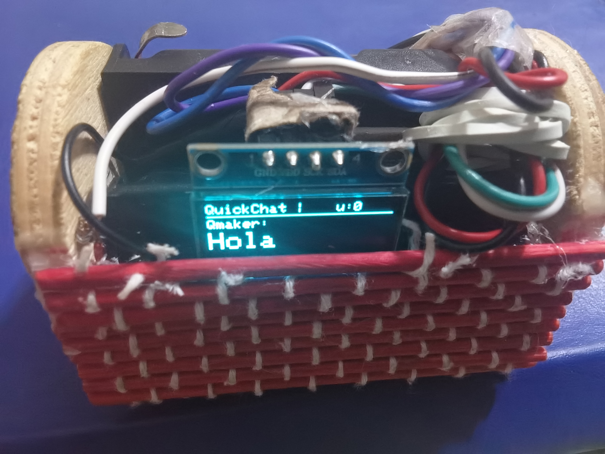

# 🚀 QuickChat S3: Offline Messaging Node

QuickChat S3 es un servidor de mensajería instantánea **100% autónomo** y de baja latencia desarrollado para el **ESP32-S3**. El proyecto implementa una arquitectura distribuida localmente (Edge Computing) para garantizar privacidad total y disponibilidad en escenarios sin infraestructura de red (Off-Grid).

## 📸 Vista Previa
| 📱 UI "Obsidian Dark" (Frontend) | ⚡ Hardware en Acción (Backend) |
| :---: | :---: |
|  |  |

## 🏗️ Arquitectura del Sistema (Deep Dive)

A diferencia de las implementaciones estándar, QuickChat utiliza un enfoque de **procesamiento paralelo** aprovechando los dos núcleos del ESP32-S3:

* **Core 0 (Network Stack & API):** Gestiona el Soft Access Point, el servidor HTTP asíncrono y el broker de WebSockets.
* **Core 1 (UI Engine & I/O):** Renderizado de la interfaz OLED 128x64 y gestión de glifos Unicode/Emoji.
* **Inter-Core Sync:** Uso de **Mutexes** y secciones críticas de FreeRTOS para garantizar la integridad de los datos en el historial compartido.

### ⚙️ Stack Tecnológico
* **Networking:** WebSockets (RFC 6455) para comunicación Full-Duplex.
* **Storage Engine:** **LittleFS** con serialización **JSON** (ArduinoJson 6/7) para persistencia de estado (IP-User Mapping) e historial de mensajes.
* **Memory Management:** Optimización de buffers para evitar fragmentación de HEAP durante el broadcast de mensajes.

## 🛠️ Especificaciones de Hardware
* **MCU:** ESP32-S3 (Dual-Core Xtensa® LX7, 240MHz).
* **Display:** OLED SSD1306 (I2C) - Bus de 400kHz.
    * `SDA: GPIO 8` | `SCL: GPIO 9`
* **Protocolo:** IEEE 802.11 b/g/n (SoftAP Mode).
* **Power:** 5V-6V via VCC/USB. Compatible con LiPo + TP4056.

## 📚 Dependencias de Software
El proyecto requiere las siguientes librerías (disponibles en Arduino Library Manager):
1.  **Adafruit SSD1306** & **GFX**: Renderizado de bajo nivel.
2.  **WebSockets** (Markus Sattler): Motor de tiempo real.
3.  **ArduinoJson**(de Benoit Blanchon): Parsing eficiente de tramas de chat.

## 🚀 Implementación y Deployment

1.  **Configuración del IDE**: Seleccionar placa `ESP32-S3 Dev Module`.
2.  **Particionado de Memoria**: Se recomienda un esquema con al menos **1MB de SPIFFS/LittleFS**.
3.  **Flash**: Cargar `QuickChat.ino`.
4.  **Acceso**:
    * **SSID**: `QuickChat` (WPA2: `12345678`).
    * **Gateway**: `http://192.168.4.1`.

### 🛠️ Endpoints Administrativos
* `GET /reset`: Formatea la partición LittleFS y purga la base de datos de usuarios/mensajes.
* `GET /users`: Retorna un JSON con el mapeo actual de dispositivos conectados.

---
🛡️ **Licencia**: Distribuido bajo **GNU GPL v2**. Consulta el archivo `LICENSE` para más detalles.
Desarrollado para la comunidad Maker!🛠️
